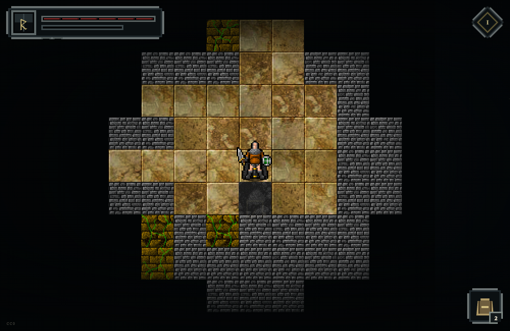

**English** · [Русский](README.ru.md)

# Little Islands

A mobile-first 2D roguelike RPG inspired by the systemic depth of NetHack and
Pathos. Tap an explored tile to choose a route; the hero moves, fights and picks
up loot automatically. The controls stay simple while procedural floors,
equipment and events create the decisions.

**▶ [Play in the browser](https://johninwork.github.io/little-islands/)** — no
account or download required.



<p align="center">
  
</p>

## Playable foundation

- Seeded room-and-corridor floors with loops, a reachable exit and fog of war.
- Tap/click pathfinding, WASD support, enemy pursuit and automatic melee combat.
- Experience, levels, health, growing difficulty and persistent progression.
- 24 active monsters, 36 loot definitions, four events and four dungeon themes.
- Twelve inventory spaces, consumables, bulk salvage and eight equipment slots.
- Armour, headgear, weapons, shields and boots appear on the paper-doll hero.
- Versioned local save with a backup; a damaged save cannot block a fresh run.
- Icon-first responsive interface designed around a 390 × 844 phone screen.

This is a playable vertical slice and a foundation for a much larger RPG, not a
claim of full NetHack content parity yet. The next planned systems are unknown
potions and scrolls, curses, resistances, status effects, icon-based choices,
unique rooms and minibosses.

## Controls

- **Phone / mouse:** tap any revealed walkable tile.
- **Keyboard:** WASD or arrow keys.
- **Combat and pickup:** automatic when the hero reaches danger or loot.
- **Backpack:** the single lower-right button; Escape closes it on desktop.

## Development

Requires Node.js 22 or newer:

```bash
npm ci
npm run check
npm run dev
```

The game uses Vite, Canvas 2D and plain JavaScript modules. Rules, content and
rendering are separated so new monsters and items can be added as data rather
than copied into the game loop:

- `tools/dcss-rpg-content.js` — monster, item and event catalogs.
- `tools/dcss-rpg-core.js` — deterministic generation, pathfinding and save rules.
- `tools/dcss.js` — Canvas rendering, input, combat and presentation.
- `docs/2D-RPG-FOUNDATION.md` — invariants and safe extension recipes.

GitHub Actions runs the deterministic test suite and publishes `main` to Pages.

## Art and attribution

The local library contains 3,383 unmodified PNG tiles from the official
[Dungeon Crawl Stone Soup tile repository](https://github.com/crawl/tiles),
released under CC0 / public-domain dedication. Only the active catalog is loaded
by the browser. Source details are preserved in
[`public/assets/dcss-preview/LICENSE.md`](public/assets/dcss-preview/LICENSE.md)
and [THIRD_PARTY_ASSETS.md](THIRD_PARTY_ASSETS.md).

The previous 3D prototype remains in git history and is no longer the active
game or development direction.
