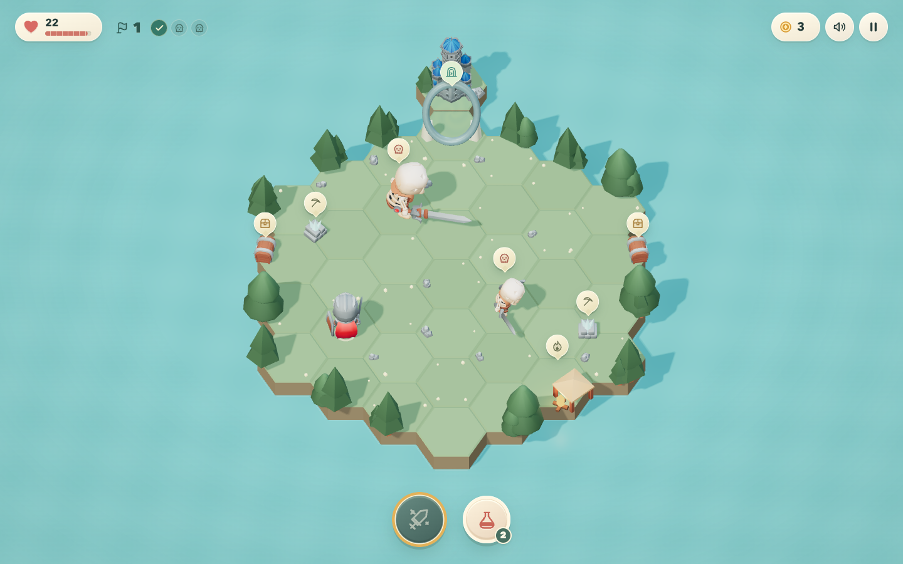
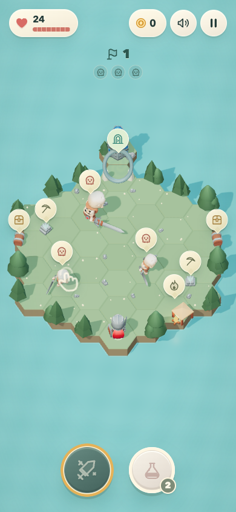

**English** · [Русский](README.ru.md)

# Little Islands

A small, touch-first 3D adventure. A knight, a handful of hexagons, three guardians and a portal to the next island. Tap where you want to go; the knight walks, fights, mines and opens chests on his own. Almost no words on screen — just icons, motion and a little more loot.

**▶ [Play in the browser](https://johninwork.github.io/little-islands/)** — made for a phone, works on desktop too. No account or download.



## How it plays

- **One tap is an instruction.** Choose a skeleton, crystal, chest or empty hex. The knight finds a route and handles the action, with animated attacks, mining and chest lids.
- **Three guardians, one exit.** Defeat the two skeletons and their larger guardian to open the portal. Each island rearranges encounters and decoration; three visual biomes rotate as you advance.
- **Two buttons in a fight.** The sword triggers a sweeping attack with a cooldown. The potion restores half your health. A camp offers a one-use full heal.
- **A little stronger every island.** Spend coins between islands on damage, health or potion capacity. Equipment changes as the weapon upgrade grows. Defeat keeps your coins and upgrades.
- **Pick up where you left off.** Progress saves in this browser. The game can run offline after a complete first load and can be added to the home screen on supported browsers.

<p align="center">
  
</p>

On desktop, click to move or interact. **Space** — sweeping attack, **H** — potion, **Escape** — pause.

## Running it

Node.js 22 or newer:

```bash
npm ci
npm run dev
```

For the production build:

```bash
npm run build
npm run preview
```

Open `http://localhost:4173`. To test on a phone on the same Wi-Fi, use the network address printed by the preview server. GitHub Actions builds and publishes `main` to GitHub Pages.

## Stack

Three.js, Vite and plain JavaScript. Instanced hex terrain, skeletal character animation, soft shadows, procedural sound and a small icon-based DOM interface. No game server or external API.

- `src/main.js` — game loop, pathfinding, combat, effects and save state.
- `src/world.js` — islands, biomes, props and world reactions.
- `src/actors.js` — animated characters and visible equipment.
- `src/ui.js` / `src/style.css` — responsive HUD and overlays.
- `public/sw.js` — scoped offline cache.

## Assets

The models are ready-made **[KayKit](https://kaylousberg.com/game-assets)** assets; the mining pickaxe comes from **[Kenney](https://kenney.nl/assets/survival-kit)**. Their original CC0 license files are included. The interface uses SVG icons and CSS. See [third-party credits](THIRD_PARTY_ASSETS.md) for the complete list, including assets retained from the earlier prototype.
