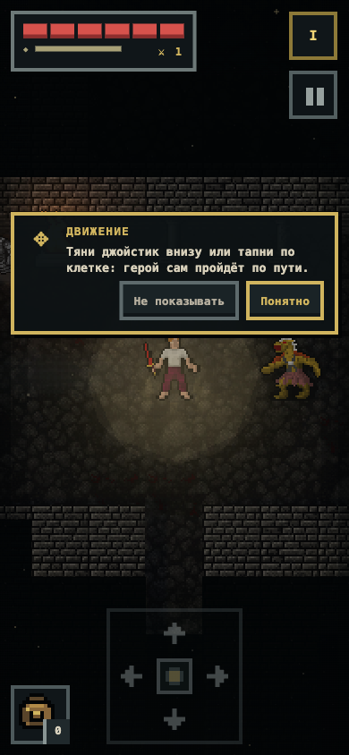

# DNG Codex

Мобильная пиксельная roguelike/RPG, вдохновлённая системностью Pathos и NetHack.
Девять этажей в трёх главах, хранители на III/VI/IX и артефакт в самом низу.
Герой сражается и подбирает добычу автоматически — ты выбираешь путь,
экипировку и риск.

[Открыть опубликованную игру](https://johninwork.github.io/little-islands/)
· [Начать разработку](docs/START-HERE.md)
· [Следующие задачи](docs/NEXT-TASKS.md)
· [Выпуск раннего доступа](docs/RELEASE.md)

Название репозитория `little-islands` пока сохраняет прежние ссылки; продукт,
PWA и сохранения называются **DNG Codex**. Статус: бесплатный ранний доступ,
версия из `package.json` видна в главном меню.



## Текущая основа

- Воспроизводимые этажи, туман войны, двери, ловушки, события и бой с растущей
  сложностью; законченный девятиэтажный забег с победой и смертью.
- Старт с нуля: поношенная рубаха и ржавый меч; 50+ предметов с видимой
  экипировкой, неопознанные зелья, свитки, жезлы и книги, свойства и артефакты.
- Ручная магия: три слота, Огненная стрела, Ледяное копьё, Грозовой разряд,
  Криомантия, лечение, Полёт, Невидимость; единый экран выбора цели.
- Находки в комнатах: сундуки-контейнеры, тайники, кристаллы, гробницы, древний
  алтарь; торговцы с конечным кошельком и обратным выкупом на III/VI/IX.
- Затопленные залы: мель замедляет и мочит всех, молния бьёт по луже, в воде
  живут угорь и мерфолк.
- Своё лицо у каждой главы: пепел, песок и снег в воздухе, гробничный ревенант
  во второй главе и сирена в третьей.
- Голод, охота на пассивных животных и готовка у костра; горение, мокрота,
  холод и яд с общими правилами.
- 40 навыков в фундаменте, 23 рабочих: восемь разведки, восемь боевых техник по
  семействам оружия, три школы магии и вся ветка выживания; очко за уровень по
  выбору игрока.
- Тайник под плитой на большинстве этажей: он существует только для героя,
  который вложился в Поиск тайников.
- Лагерь из походного набора: костёр, спальник со сном за голод и личный сундук,
  который едет с героем между этажами. Заклинание «Зов лагеря» ставит его без
  набора.
- Повар снимает с костра блюдо, а не просто жареное мясо: одно временное
  усиление за раз. Бинты лечат и снимают яд и огонь, выносливость укорачивает
  любое вредное состояние.
- Город на четвёртом этаже: улицы и кварталы вместо коридоров, до четырёх
  торговцев, патрули стражи. Стражника можно ударить, но только намеренно —
  и тогда за героя возьмётся весь квартал.
- Свой дом в городе: участок покупается за золото, внутри за деньги ставятся
  кровать, сундук и очаг. Камень возвращения уносит из подземелья домой и
  возвращает ровно туда, откуда ушёл.
- 22 вида оружия семи семейств, у каждого своя техника: засада кинжалом,
  ломающая броню булава, встречный укол копьём, прицельный выстрел из лука.
- Карта этажа, экран итогов забега, пять подсказок первого этажа, записанные
  CC0-звуки с регулятором, RU/EN, объёмные стены, свет и тени.
- Версионированное локальное сохранение v35 с резервной копией и миграцией
  прежних забегов; единственная валюта — золото.

Полный объём правил NetHack, все 40 способностей, приручение, мультиплеер и
долговременный баланс большого каталога пока не реализованы.

## Управление

- Телефон: джойстик внизу по центру или тап по разведанному полу; рюкзак и
  кнопка взаимодействия слева, заклинания справа.
- Компьютер: мышь, WASD или стрелки; M — карта этажа, Escape закрывает окно.
- Бой и подбор: автоматически; новый приказ движения задаёт отход или новый путь.
- Характеристики и навыки: тап по здоровью героя. Меню и окна ставят мир на
  паузу.

## Локальный запуск

Нужен Node.js `^22.13.0` или `>=24` (поле `engines` в `package.json`).

```bash
npm ci
npm run check
npm run dev
```

Открой адрес из вывода Vite. Главная страница перенаправляет на
`/tools/dcss.html`. Для телефона в той же Wi-Fi-сети:

```bash
npm run dev -- --host 0.0.0.0
```

Сохранения привязаны к адресу браузера и не переносятся между localhost и LAN
автоматически.

## Выпуск

`npm run package:itch` собирает `release/dng-codex-itch.zip` — только
используемые спрайты (itch.io принимает не больше 1000 файлов). Настройки
страницы, тексты RU/EN и чеклист — в [docs/RELEASE.md](docs/RELEASE.md).

Стек: Vite, JavaScript ESM, Canvas и Three.js для геометрии и освещения.
[Карта модулей и правила расширения](docs/START-HERE.md).

## Графика и звук

Пиксельные ассеты взяты из
[официального репозитория Dungeon Crawl Stone Soup](https://github.com/crawl/tiles)
(CC0, каталоги `mon`, `item`, `player`, `dngn`, `effect`), сундуки — демо-пак
Cmski, звуки — записанные CC0-сэмплы (Kenney, qubodup, Still North Media,
wolfwoot, artisticdude, rubberduck, BigSoundBank и другие). Браузер загружает
только используемые файлы.
[Лицензия графики](public/assets/dcss-preview/LICENSE.md),
[лицензия звуков](public/assets/audio/LICENSE.md),
[атрибуция проекта](THIRD_PARTY_ASSETS.md).
